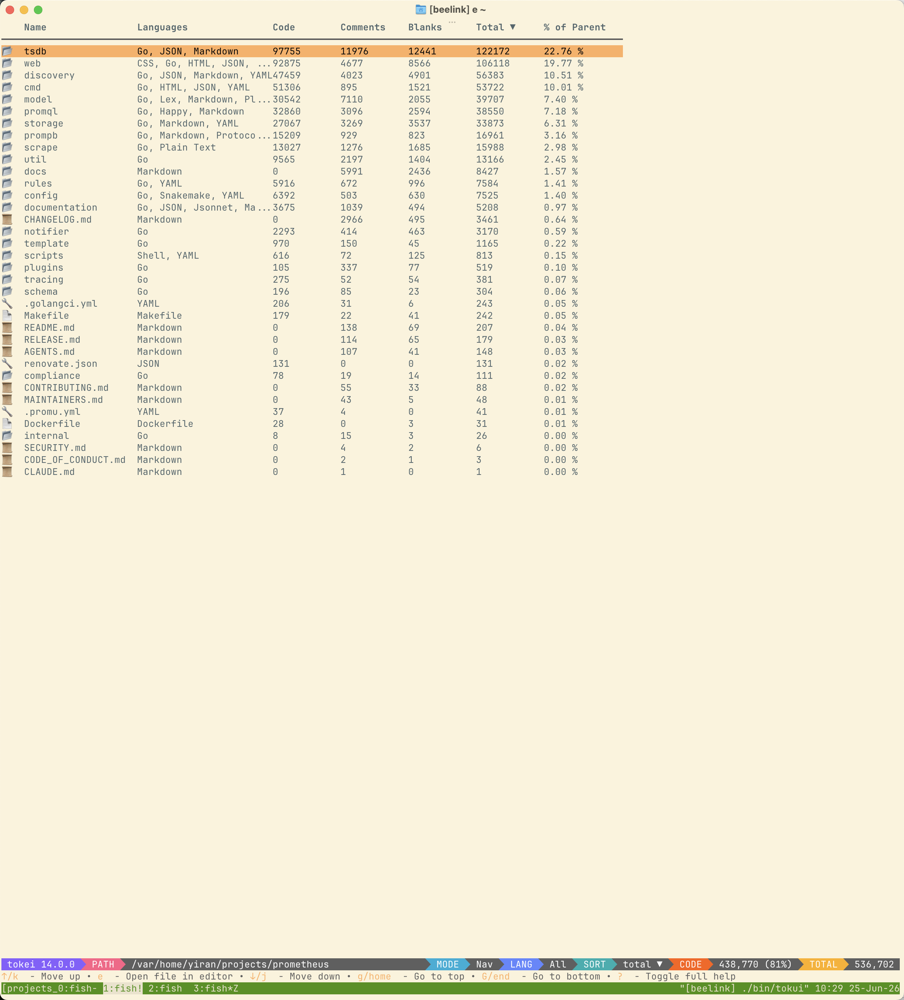
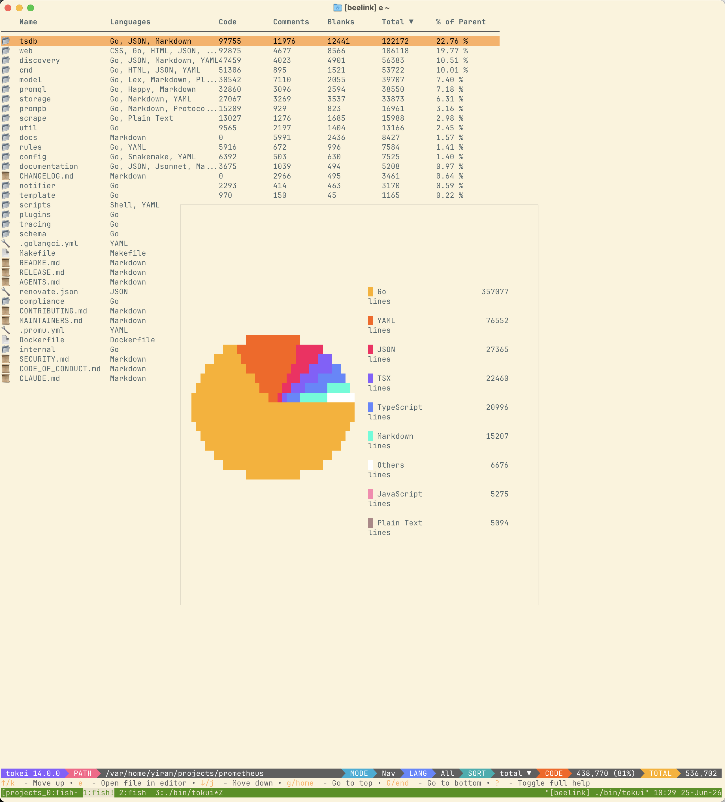
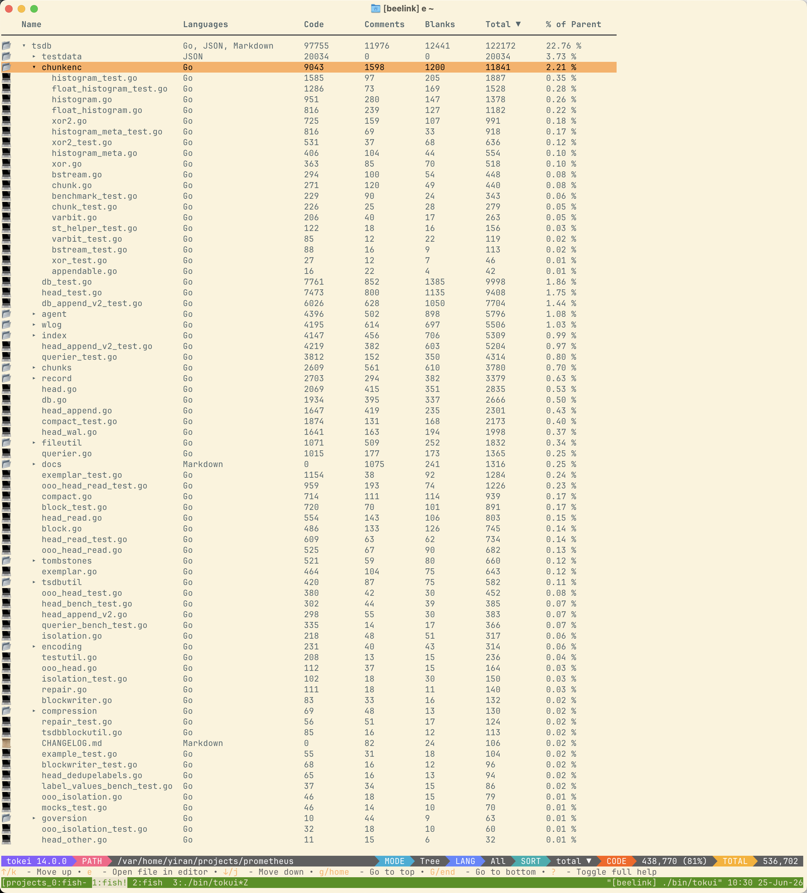
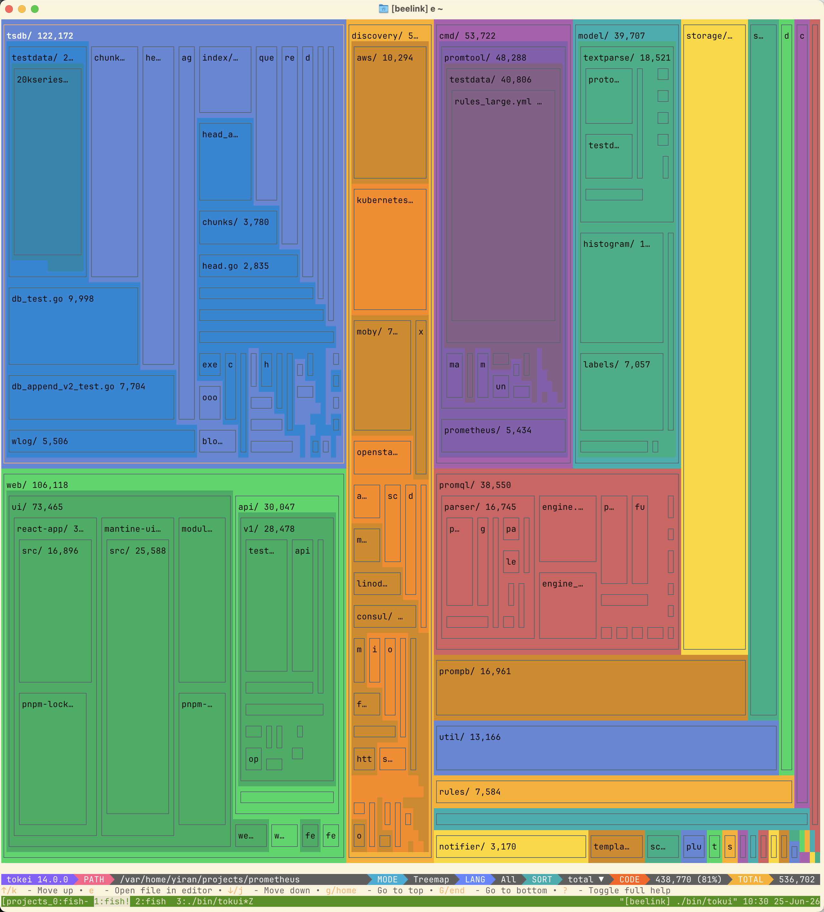

# 📊 Tokui

[](https://github.com/zdyxry/tokui/actions/workflows/build.yml)
[](https://goreportcard.com/report/github.com/zdyxry/tokui)

**Tokui** is a high-performance, cross-platform command-line tool for visualizing and exploring code statistics. It integrates with the powerful code statistics engine [tokei](https://github.com/XAMPPRocky/tokei) by default, and also supports [scc](https://github.com/boyter/scc) as an optional backend, to present code line count and complexity metrics through a responsive, keyboard-driven Terminal User Interface (TUI), helping you quickly analyze code composition and understand project structure.

> **Project Origin**
>
> This project is a fork of the excellent disk space analyzer [noxdir](https://github.com/crumbyte/noxdir), heavily modified and refactored by a **Large Language Model (LLM)** to transform it from a disk analyzer into a code statistics visualizer.

## 📸 Previews

Screenshots below show `tokui` analyzing the [Prometheus](https://github.com/prometheus/prometheus) codebase.

| Default View | Language Distribution (`Ctrl+w`) |
|:---:|:---:|
|  |  |
| **Tree Mode** | **Treemap Mode** |
|  |  |

## ✨ Features

- **Interactive Terminal UI**: Navigate, filter, and explore your project with an intuitive keyboard-driven interface.
- **Multiple Stats Providers**: Use `tokei` (default) for line counts, or switch to `scc` for complexity metrics.
- **Deep Tokei Integration**: Leverages `tokei` for accurate lines of code, comments, blanks, and total lines, categorized by language.
- **File Preview**: Press `Enter` on any file to instantly preview its contents in a scrollable overlay window.
- **Language Filtering**: Filter by a single language (`Tab`), or select multiple languages via the multi-select overlay (`Ctrl+L`).
- **Visual Charts**: Toggle a language distribution pie chart with `Ctrl+w`.
- **Column Sorting**: Sort the directory listing by any column (`s`) and toggle ascending/descending order (`S`).
- **Tree Mode**: Toggle tree mode (`t`) to expand and collapse directories inline.
- **Treemap Mode**: Toggle treemap mode (`m`) to visualize directory composition with proportional colored blocks.
- **Mouse Support**: Scroll, click, and double-click to navigate rows and overlays.
- **Zero-Dependency Release**: Pre-built binaries bundle `tokei` internally—no separate installation required.
- **Privacy-Focused**: Runs entirely locally. No telemetry or data uploads, ever.

## ⚠️ Prerequisites

**Pre-built release binaries have `tokei` embedded**—no manual installation is needed.

If you are building from source or want to use your own `tokei` installation, ensure `tokei` is available in your `PATH`. Tokui will automatically prefer the system-installed version if present.

- **Install `tokei`** (optional): [https://github.com/XAMPPRocky/tokei#installation](https://github.com/XAMPPRocky/tokei#installation)

## 📦 Installation

### Pre-compiled Binaries

Download the latest release from the [Releases](https://github.com/zdyxry/tokui/releases) page. Unzip and run—no extra installation required.

### Using `go install` (Go 1.25+)

```bash
go install github.com/zdyxry/tokui@latest
```

This downloads, compiles, and installs the latest `tokui` binary into your `$GOPATH/bin` (or `$GOBIN`). The `tokei` binary is embedded at compile time, so no separate `tokei` installation is required.

### Build from Source (Go 1.25+)

```bash
# Clone the repository
git clone https://github.com/zdyxry/tokui.git
cd tokui

# Download tokei binaries for embedding (optional but recommended)
make fetch-tokei-binaries

# Build
make build

# Run
./bin/tokui
```

> **Note**: `make fetch-tokei-binaries` downloads platform-specific `tokei` binaries that will be embedded into the final executable. If skipped, the build will still succeed using placeholder files; the resulting binary will fallback to a system-installed `tokei` at runtime.

## 🛠️ Usage

Tokui supports two modes of operation:

### 1. Direct Mode (Recommended)

Tokui automatically invokes the selected provider (`tokei` by default) to analyze the specified directory.

```bash
# Analyze the current directory with tokei
tokui

# Analyze with scc for complexity metrics
tokui --provider scc

# Or set the provider via environment variable
TOKUI_PROVIDER=scc tokui

# Analyze a specific directory
tokui /path/to/your/project
```

### 2. Pipe Mode

If you have `tokei` installed separately, run it manually with custom arguments and pipe its JSON output to `tokui`. This is useful for advanced filtering (e.g., `--exclude`). `tokui` also accepts `scc --by-file -f json` output and auto-detects the format.

```bash
# Analyze the current directory with tokei
tokei -o json . | tokui

# Analyze a specific directory and exclude node_modules
tokei -o json --exclude node_modules . | tokui

# Or use scc for complexity metrics
scc --by-file -f json . | tokui
```

### CLI Arguments

```
Usage:
  tokui [directory] [flags]

Flags:
  -r, --root string    Specify the root directory to analyze. Defaults to the current directory ".".
      --provider       Stats provider: tokei|scc. Defaults to tokei; can be set via TOKUI_PROVIDER env var.
  -t, --tree           Start in tree mode. Directories are expandable inline instead of navigable.
      --treemap        Start in treemap mode. Show proportional blocks instead of a table.
  -h, --help           Show help information
```

## ⌨️ Keybindings

### Main View

| Key                 | Action                                                              |
| ------------------- | ------------------------------------------------------------------- |
| `↑` / `k`           | Move cursor up                                                      |
| `↓` / `j`           | Move cursor down                                                    |
| `g` / `home`        | Go to top                                                           |
| `G` / `end`         | Go to bottom                                                        |
| `Enter`             | Enter directory / Expand-Collapse directory / Preview file          |
| `e`                 | Open file in editor                                                 |
| `Backspace`         | Go back to the parent directory                                     |
| `t`                 | Toggle navigation mode / tree mode                                  |
| `m`                 | Toggle treemap mode                                                 |
| `Tab`               | Cycle through language filters                                      |
| `Ctrl`+`L`          | Open multi-language selection overlay                               |
| `/`                 | Activate file name filter (press `Esc` to exit filter mode)         |
| `Ctrl`+`P`          | Open global fuzzy search (press `Enter` to jump, `Esc` to close)    |
| `s`                 | Cycle sort column (Name → Languages → Code → Comments → Blanks → Total → % of Parent) |
| `S`                 | Toggle ascending / descending order for the current sort column     |
| `Ctrl`+`w`          | Show/hide language distribution pie chart                           |
| `?`                 | Show/hide full help                                                 |
| `q` / `Ctrl`+`c`    | Quit the application / Close file preview                           |

### File Preview Mode

| Key                 | Action                                                              |
| ------------------- | ------------------------------------------------------------------- |
| `↑` / `k`           | Scroll up                                                           |
| `↓` / `j`           | Scroll down                                                         |
| `PgUp`              | Page up                                                             |
| `PgDn`              | Page down                                                           |
| `q` / `Esc`         | Close file preview and return to directory view                     |

### Mouse Support

Tokui also supports basic mouse interaction in terminals that report mouse events:

| Action              | Effect                                                              |
| ------------------- | ------------------------------------------------------------------- |
| Scroll wheel        | Move cursor / scroll previews and language lists                    |
| Left click          | Select a row or an item in the language selection overlay           |
| Left click header   | Sort by the clicked column (click again to toggle ascending/descending) |
| Double left click   | Enter directory, expand/collapse directory, or open file preview    |
| Double left click `..` | Go back to the parent directory                                    |
| Click outside overlay | Close the file preview, language selection, or chart overlay       |

## 🤝 Contributing

Pull Requests are welcome! If you'd like to add new features or report bugs, please open an issue first to discuss your ideas.

## 📝 License

Tokui is licensed under the [MIT License](./LICENSE).

This project bundles a copy of [tokei](https://github.com/XAMPPRocky/tokei) (MIT OR Apache-2.0) for zero-dependency operation. See [THIRD-PARTY-LICENSES](./THIRD-PARTY-LICENSES) for details.
